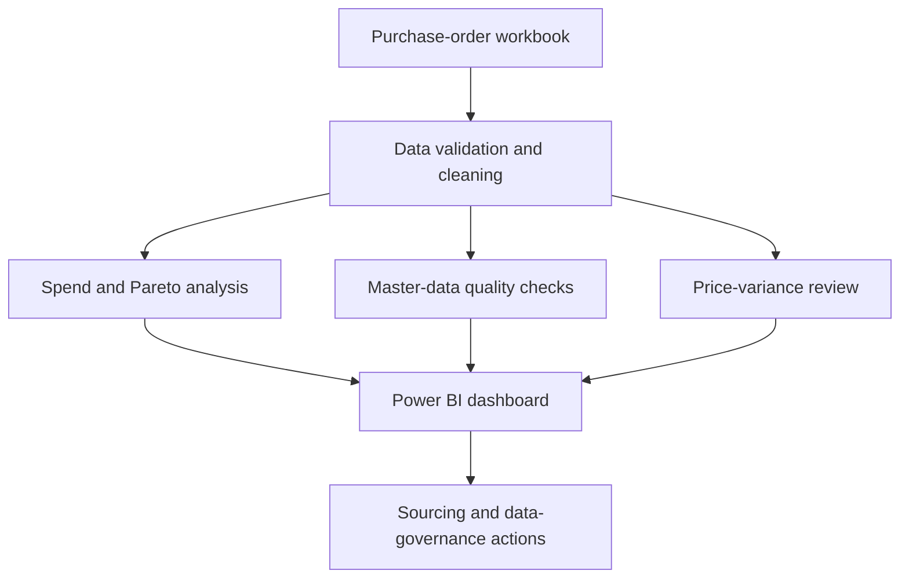

# Procurement Spend and Master Data Analytics

An end-to-end procurement analytics portfolio project designed around the **Spend and Master Data Analyst** role at Pcura Consulting.

The project converts purchase-order data into spend-concentration analysis, tail-spend diagnostics, material-master quality checks, price-variance review candidates and a taxonomy-mapping workflow.

## Business context

Pcura provides procurement, strategic sourcing, spend analysis, master-data management and source-to-pay services. Its Spend and Master Data Analyst opening asks for experience with spend/master-data projects and knowledge of procurement taxonomies such as UNSPSC or eClass.

This project addresses five questions:

1. Where is procurement spend concentrated?
2. How much activity sits in tail spend and low-value purchase orders?
3. Which material-master fields are incomplete or inconsistent?
4. Which materials show unit-price variation that requires commercial review?
5. How can source material groups be prepared for an approved UNSPSC/eClass mapping?

## Dataset

- Source: [Spend Analytics on Kaggle](https://www.kaggle.com/datasets/mukeshmanral/spend-analytics)
- Source sheet analysed: `Data`
- Purchase-order lines: **75,349**
- Purchase documents: **42,596**
- Material groups: **145**
- Plants: **116**
- Unique material IDs: **2,757**
- Gross spend: **23.997B source-currency units**

The Kaggle metadata reports the license as unspecified. The source workbook and record-level extracts are therefore excluded from this repository. Download instructions are provided in [`data/raw/README.md`](data/raw/README.md).

## Key findings

- **Major spend represents 80.5%** of gross spend; source-labelled tail spend represents 19.5%.
- Only **24 of 7,332 purchase descriptions** account for approximately 80% of total spend.
- The top five material groups account for **91.2% of spend**, indicating high category concentration.
- **45.1% of purchase orders are single-line orders**, creating a useful process-efficiency and consolidation question.
- Purchase orders at or below 100K represent **43.7% of all documents but only 1.8% of spend**, a strong tail-spend fragmentation signal.
- `Requested By` is missing for **91.8%** of lines, `Priority` for **80.6%**, and `Input Tax Credit` for **79.3%**.
- **1,454 of 2,757 material IDs** have more than one description, unit of measure or material-group assignment.
- **581 material/UOM combinations** with at least five transactions show a price spread above 50%. These are review candidates, not confirmed savings.

## Recommended actions

1. Prioritize sourcing strategies for the top material groups and descriptions that dominate spend.
2. Review low-value PO creation and identify opportunities for catalogues, blanket orders or purchase consolidation.
3. Establish mandatory ownership and validation rules for requester, priority, storage-location and tax fields.
4. Standardize material descriptions, units of measure and material-group assignments before taxonomy enrichment.
5. Review price-variance candidates with procurement, considering timing, specification, quantity, plant and commercial terms before estimating savings.
6. Complete the supplied taxonomy template with procurement-approved UNSPSC or eClass codes; the pipeline deliberately does not invent official classifications.

## Repository structure

```text
.
├── data/raw/                  # Local source workbook; excluded from Git
├── docs/data_dictionary.md   # Field definitions and limitations
├── outputs/
│   ├── figures/              # Portfolio-ready visualizations
│   └── tables/               # Aggregated analytical outputs
├── powerbi/README.md         # Dashboard model, pages and DAX measures
├── sql/spend_analysis.sql    # Reusable SQL analysis queries
├── src/build_analysis.py     # Reproducible Python pipeline
├── requirements.txt
└── README.md
```

## Analytical workflow



## Run the project

```bash
python -m venv .venv
```

Activate the environment, install the dependencies, download the workbook as described in `data/raw/README.md`, and run:

```bash
pip install -r requirements.txt
python src/build_analysis.py
```

The pipeline writes aggregated tables to `outputs/tables` and visualizations to `outputs/figures`.

## Power BI dashboard design

The recommended dashboard has four pages:

1. **Executive Spend Overview** - spend, POs, material groups, plants, spend class and monthly trend.
2. **Category and Pareto Analysis** - material-group concentration, description Pareto and ABC classification.
3. **Tail Spend and Fragmentation** - PO-value bands, single-line orders and low-value transaction volume.
4. **Master Data Quality** - missing-field rates, material consistency issues, taxonomy status and price-variance review candidates.

See [`powerbi/README.md`](powerbi/README.md) for the data model and sample DAX.

## Limitations

- Supplier identifiers are not present, so supplier concentration and supplier rationalization cannot be calculated.
- The dataset contains historical transaction dates and should be treated as a portfolio case study rather than a current business forecast.
- Price variation may reflect timing, location, quantity, specification or commercial terms; it is not automatically a savings opportunity.
- Proposed internal categories are keyword-based review suggestions, not validated UNSPSC or eClass codes.

## Skills demonstrated

Procurement analytics, spend classification, Pareto/ABC analysis, tail-spend analysis, master-data quality, taxonomy readiness, Python, pandas, SQL, Power BI planning, data validation and business recommendations.

